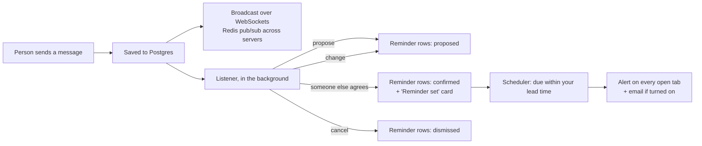

<div align="center">

# UNaFIED

**Real-time chat where plans you agree on become reminders.**


</div>

People chat with each other in real time: start a chat from someone's email, or add people to any conversation. A **Listener** agent reads every message in a shared chat. When someone proposes a time ("let's meet at 4 pm today?") and someone else agrees ("sure, see you then"), it sets a reminder for everyone in the chat. It then posts a "Reminder set" card and alerts each person ahead of time, 15 minutes before by default. People can change that lead time, and can turn on email.

An assistant, **@unafied**, lives in every chat too. It answers every message when you chat with it alone. In a shared chat it stays quiet until someone mentions it.

## How it works



- **Plans need two people.** A proposal creates a `proposed` reminder for each person in the chat. It becomes `confirmed` only when someone other than the proposer agrees. Changing the time ("make it 5?") sends it back to `proposed` until the other person agrees again.
- **Times are exact.** The model reads "4 pm today" in the sender's time zone, which the browser reports on sign-in, and answers in local time. The server converts that to UTC, and all timestamps are stored as `timestamptz`.
- **Each person owns their reminder.** Undo on the card, or Remove in the reminders list, only affects your own copy.
- **Replies never wait.** The Listener runs on a Celery worker after the message is delivered. The worker takes one job at a time, so each conversation's messages are read in order, whichever server received them.
- **Alerts come from the server.** Celery beat runs the reminder check every 30 seconds, which claims each due reminder with one atomic update, so it fires once even with several servers. Because its state lives in the database, restarts lose nothing. Each person's open tabs share one app-wide socket, which also carries unread markers and new conversations.

## Stack

| | |
| :--- | :--- |
| Backend | Python 3.12, FastAPI (HTTP + WebSockets), SQLModel, Alembic, managed with `uv` |
| Data | PostgreSQL with `pgvector` (Neon in development), Redis pub/sub |
| AI | Pydantic-AI on Groq (`openai/gpt-oss-120b`), Gemini embeddings for context search |
| Frontend | React 19, Vite, Tailwind v4, Zustand, Framer Motion |

## Run it locally

**Backend** (needs Postgres with `pgvector` and Redis):

```bash
cd backend
# create .env with the variables in the table below
uv sync
uv run alembic upgrade head
uv run uvicorn main:app --reload
uv run celery -A app.worker worker -B --loglevel info   # second terminal: the Listener and reminder alerts
```

| Variable | What it is |
| :--- | :--- |
| `DATABASE_URL` | Postgres connection string |
| `REDIS_URL` | e.g. `redis://localhost:6379/0` |
| `SECRET_AUTH_KEY` | Signs the JWTs |
| `GROQ_API_KEY` | The assistant and the Listener |
| `GEMINI_API_KEY` | Message embeddings |
| `CORS_ORIGINS` | e.g. `http://localhost:5173` |
| `DEBUG` | `true` or `false` |
| `GOOGLE_CLIENT_ID`, `GOOGLE_CLIENT_SECRET` | Optional. A Google OAuth Web client; set both to turn on "Continue with Google". Add `http://localhost:5173` to its Authorized JavaScript origins |
| `SMTP_HOST`, `SMTP_PORT`, `SMTP_USER`, `SMTP_PASSWORD`, `SMTP_FROM` | Optional. Set them to email reminders; leave `SMTP_HOST` unset to turn email off |

**Frontend:**

```bash
cd frontend
npm install
npm run dev   # http://localhost:5173, talks to http://localhost:8000
```

**Reminder emails through Gmail.** Use Gmail's own mail server with an app password. You don't need Google OAuth for this; Gmail API tokens from an unreviewed app expire every 7 days.

1. Turn on 2-Step Verification for the sending Google account, then create an app password at https://myaccount.google.com/apppasswords.
2. Add to `backend/.env`:

```bash
SMTP_HOST=smtp.gmail.com
SMTP_PORT=587
SMTP_USER=you@gmail.com
SMTP_PASSWORD=your-16-character-app-password
SMTP_FROM=you@gmail.com
```

Each person still chooses "Email me too" in their reminder settings.

**Everything in Docker** (its own Postgres, Redis, Mailpit and Celery worker; secrets still come from `backend/.env`). Reminder emails land in Mailpit at http://localhost:8025 instead of real inboxes:

```bash
docker compose up --build
```

## Tests

```bash
cd backend
uv run pytest                          # API, sockets, permissions, scheduler, Listener rules (model stubbed)
uv run python -m evals.listener_eval   # 43 labelled chats against the real model
```

The eval sends one request per case, one at a time, because Groq rate-limits bursts.

## Layout

```
backend/
  app/agents/listener_agent.py   what a message does to the chat's plans (pure, no database)
  app/services/listener.py       runs it in the background and applies the decision
  app/services/scheduler.py      fires due reminders: alerts and email
  app/worker.py                  Celery: runs the Listener and the 30-second reminder check
  app/api/routes/reminders.py    list, confirm and dismiss your reminders
  app/api/websockets/            per-conversation sockets, Redis fan-out
  alembic/versions/              migrations
  evals/listener_eval.py         labelled cases for the Listener
frontend/
  src/stores/reminderStore.ts    reminders, polling, and when to alert
  src/components/chat/           thread, rail, reminder card and alerts
```

## Known limits

- **Closed tabs need email.** With every tab closed, only email reaches you, and only when SMTP is set. Web Push would cover that.
- **One Listener call at a time.** The single worker process keeps every conversation in order, but busy chats queue behind each other. Splitting chats across several single-process queues would lift that.
- **One model call per message.** Every message in a shared chat costs one model call.

## License

MIT
