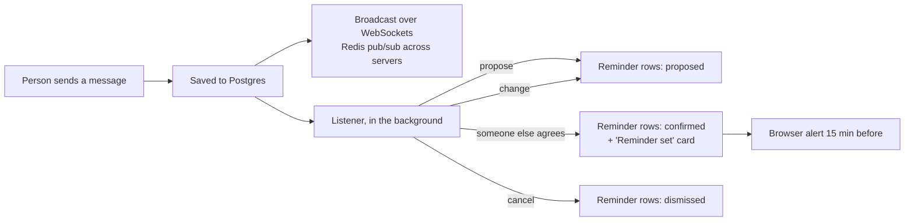

<div align="center">

# UNaFIED

**Real-time chat where plans you agree on become reminders.**


</div>

People chat with each other in real time. A **Listener** agent reads every message in a shared chat. When someone proposes a time ("let's meet at 4 pm today?") and someone else agrees ("sure, see you then"), it sets a reminder for everyone in the chat. It then posts a "Reminder set" card and alerts each person 15 minutes before.

An assistant, **@unafied**, lives in every chat too. It answers every message when you chat with it alone. In a shared chat it stays quiet until someone mentions it.

## How it works



- **Plans need two people.** A proposal creates a `proposed` reminder for each person in the chat. It becomes `confirmed` only when someone other than the proposer agrees. Changing the time ("make it 5?") sends it back to `proposed` until the other person agrees again.
- **Times are exact.** The model reads "4 pm today" in the sender's time zone, which the browser reports on sign-in, and answers in local time. The server converts that to UTC, and all timestamps are stored as `timestamptz`.
- **Each person owns their reminder.** Undo on the card, or Remove in the reminders list, only affects your own copy.
- **Replies never wait.** The Listener runs after the message is delivered, one message at a time per conversation.

## Stack

| | |
| :--- | :--- |
| Backend | Python 3.12, FastAPI (HTTP + WebSockets), SQLModel, Alembic, managed with `uv` |
| Data | PostgreSQL with `pgvector` (Neon in development), Redis pub/sub |
| AI | Pydantic-AI on Groq (`openai/gpt-oss-120b`), Gemini embeddings for context search |
| Frontend | React 19, Vite, Tailwind v4, Zustand, Framer Motion |

## Run it locally

**Backend** (needs Postgres with `pgvector` and Redis):

```bash
cd backend
# create .env with the variables in the table below
uv sync
uv run alembic upgrade head
uv run uvicorn main:app --reload
```

| Variable | What it is |
| :--- | :--- |
| `DATABASE_URL` | Postgres connection string |
| `REDIS_URL` | e.g. `redis://localhost:6379/0` |
| `SECRET_AUTH_KEY` | Signs the JWTs |
| `GROQ_API_KEY` | The assistant and the Listener |
| `GEMINI_API_KEY` | Message embeddings |
| `CORS_ORIGINS` | e.g. `http://localhost:5173` |
| `DEBUG` | `true` or `false` |

**Frontend:**

```bash
cd frontend
npm install
npm run dev   # http://localhost:5173, talks to http://localhost:8000
```

**Everything in Docker** (its own Postgres and Redis; secrets still come from `backend/.env`):

```bash
docker compose up --build
```

## Tests

```bash
cd backend
uv run pytest                          # API, reminders, and Listener rules (model stubbed)
uv run python -m evals.listener_eval   # 43 labelled chats against the real model
```

The eval sends one request per case, one at a time, because Groq rate-limits bursts.

## Layout

```
backend/
  app/agents/listener_agent.py   what a message does to the chat's plans (pure, no database)
  app/services/listener.py       runs it in the background and applies the decision
  app/api/routes/reminders.py    list, confirm and dismiss your reminders
  app/api/websockets/            per-conversation sockets, Redis fan-out
  alembic/versions/              migrations
  evals/listener_eval.py         labelled cases for the Listener
frontend/
  src/stores/reminderStore.ts    reminders, polling, and when to alert
  src/components/chat/           thread, rail, reminder card and alerts
```

## Known limits

- **Alerts need the app open.** Alerts fire while the app is open in a tab. Reaching a closed tab needs Web Push or email.
- **One server at a time.** The Listener keeps each conversation's messages in order on a single server. Running several servers needs a shared lock.
- **One model call per message.** Every message in a shared chat costs one model call.

## License

MIT
